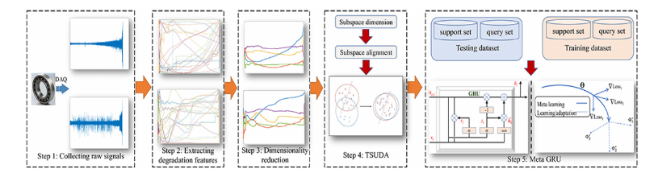
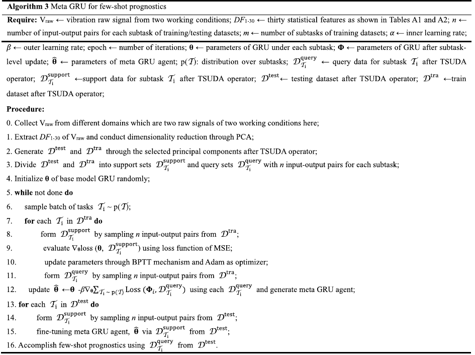

# Meta deep learning based rotating machinery health prognostics toward few-shot prognostics

**Authors:** Peng Ding, Minping Jia, Xiaoli Zhao
**Venue:** *Applied Soft Computing* 104 (2021) 107211
**DOI:** 10.1016/j.asoc.2021.107211
**Reader scope:** 与 Meta-GRU 代码复现直接相关的方法、数据和实验设置；完整原文请查看用户提供的 PDF。

## 页码/主题索引

- p.4：MDL 总体架构
- p.5：TSUDA 的协方差与 MMD 目标
- pp.5-7：Meta-GRU 双层优化
- pp.7-9：30 个特征、PCA、PRONOSTIA 数据和健康度标签
- p.18：特征公式与超参数表

## 术语表

| Canonical term | 中文 | 本项目采用形式 |
|---|---|---|
| Meta-GRU | 元学习门控循环单元 | MAML 初始化 + GRU 回归器 |
| support set | 支持集 | 子任务内循环适配数据 |
| query set | 查询集 | 元外循环或最终评价数据 |
| TSUDA | 时间序列无监督域适配 | 均值匹配 + CORAL 协方差对齐近似 |
| health degree | 健康度 | 100（健康）到 0（失效） |

## 方法架构

**Source:** p.4 S001

**Original:** The proposed framework preprocesses run-to-failure vibration signals, extracts statistical degradation features, applies unsupervised domain adaptation, divides data into support/query subtasks, performs subtask and cross-subtask gradient optimization, and finally adapts the meta prognostic agent to an unseen testing domain.

**中文:** 该框架先预处理全寿命振动信号并提取统计退化特征，再进行无监督域适配；随后把数据划分为多个支持集/查询集子任务，执行任务内与跨任务梯度优化，最后用目标域少量支持样本适配元预测器。

### Fig. 6. Meta-GRU 健康预测流程

**Placed near:** p.4 S001
**Source:** p.8 C001

**Original caption:** Fig. 6. Meta GRU based health prognostics.

**中文图注:** 图 6. 基于 Meta-GRU 的健康预测流程。

**Reading note:** 图中依次给出振动采集、统计特征、PCA、TSUDA 和 Meta-GRU 支持集/查询集学习。

## TSUDA 与域对齐

**Source:** p.5 S002

**Original:** TSUDA aligns source and target degradation indicators by jointly considering covariance matrices and maximum mean discrepancy (MMD); the paper uses separate source and target transformations and reports Riemannian gradient descent as the optimizer.

**中文:** TSUDA 联合考虑协方差矩阵与最大均值差异（MMD），对齐源域和目标域退化指标；论文采用源域、目标域两个变换，并说明用黎曼梯度下降求解。

**Source:** p.5 E001 · Eq. (6) · medium confidence

$$
\mathcal{L}_{UDA}=\delta_n^s\!\left(W_s^\top\Sigma_sW_s, W_t^\top\Sigma_tW_t\right)+\operatorname{MMD}(X_sW_s,X_tW_t)
$$

**中文说明：** 第一项匹配二阶协方差结构，第二项匹配变换后源域和目标域的分布均值嵌入。论文缺少足够的优化细节，因此代码以 CORAL + 线性 MMD 均值匹配实现可审计近似。

## Meta-GRU 双层梯度

**Source:** pp.5-7 S003

**Original:** Each task contains disjoint support and query samples. GRU parameters are adapted on support samples with MSE and BPTT; query losses from multiple tasks update the shared meta initialization. At test time, a small target support set fine-tunes the meta agent and the target query set evaluates few-shot prognosis.

**中文:** 每个任务由互不重叠的支持样本和查询样本构成。模型先用 MSE 与 BPTT 在支持集上适配 GRU 参数，再汇总多个任务的查询损失更新共享元初始化。测试时，用目标域少量支持样本微调元模型，以查询集评估少样本预测能力。

**Source:** p.6 E002 · Eq. (12)

$$
\phi_i \leftarrow \theta-\alpha\nabla_\theta\mathcal{L}\left(\theta,D^{support}_{T_i}\right)
$$

**中文说明：** 这是子任务内循环；代码允许搜索内学习率 $\alpha$ 和更新步数。

**Source:** p.6 E003 · Eq. (14)

$$
\min_\theta \sum_{T_i\sim p(T)}\mathcal{L}\left(\phi_i,D^{query}_{T_i}\right)
$$

**中文说明：** 这是跨任务外循环；查询集不参与该任务的内循环，从而学习可快速适配的新初始化。

### Algorithm 3. Meta-GRU 少样本预测算法

**Placed near:** pp.5-7 S003
**Source:** p.9 C002

**Original caption:** Algorithm 3. Meta GRU for few-shot prognostics.

**中文图注:** 算法 3. 面向少样本健康预测的 Meta-GRU。

**Reading note:** 该算法明确给出了 PCA/TSUDA、随机任务抽样、support 内更新、query 外更新以及测试域少样本适配。

## 特征、标签和实验设置

**Source:** pp.7-8 S004

**Original:** Thirty statistical features are extracted: 17 time-domain features and 13 FFT-based frequency-domain features. PCA retains components whose cumulative contribution exceeds 99%, after which TSUDA constructs domain-invariant time-series degradation indicators.

**中文:** 首先提取 30 个统计特征，包括 17 个时域特征和 13 个基于 FFT 的频域特征。PCA 保留累计贡献率超过 99% 的主成分，随后 TSUDA 生成跨域时间序列退化指标。

**Source:** pp.8-9 S005

**Original:** Both horizontal and vertical accelerometer signals are used. Labels range from 100 for complete health to 0 at final failure. Cross-validation is conducted among the three PRONOSTIA working conditions.

**中文:** 水平和垂直加速度信号均参与分析。标签从完全健康时的 100 下降到最终失效时的 0；三个 PRONOSTIA 工况之间进行交叉验证。

**Source:** p.18 S006 · Table A.3

**Original:** The reported MDL settings are 100 epochs, inner learning rate 0.0001, outer learning rate 0.0001, 20 subtasks, and 9 input-output pairs in each testing support/query set.

**中文:** 论文报告的 MDL 设置为 100 个 epoch、内学习率与外学习率均为 0.0001、20 个子任务，以及测试支持集和查询集各 9 对输入输出样本。

## 公式索引

- [E001 · Eq. (6)](#E001) — p.5，TSUDA 目标
- [E002 · Eq. (12)](#E002) — p.6，任务内更新
- [E003 · Eq. (14)](#E003) — p.6，跨任务元目标

## 阅读提示

论文未给出 GRU 隐藏维度、层数、序列窗口、dropout、内循环步数，以及足以严格复现 TSUDA 的全部优化细节。代码因此把网络与优化参数纳入源域验证搜索，并把 TSUDA 标注为统计目标一致、数值实现不同的近似，而不伪造所谓“原文参数”。
